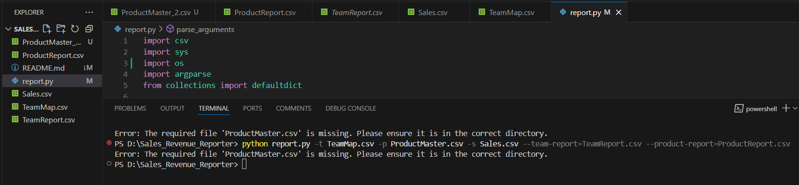
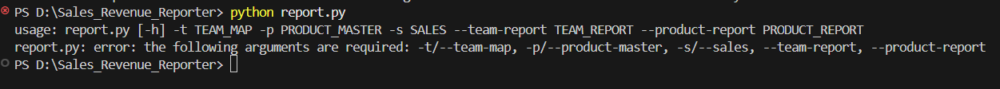
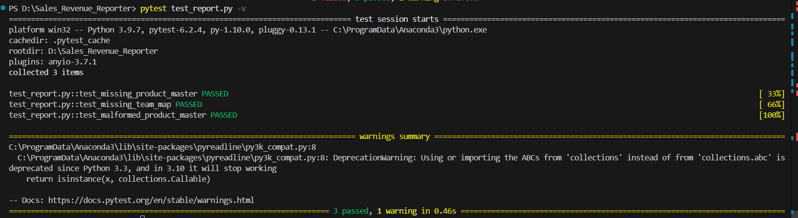

# Sales Revenue Reporter

## Overview
The **Sales Revenue Reporter** is a Python application that processes sales data from three CSV files and generates two output reports:
1. **Team Report** (`TeamReport.csv`): Summarizes total gross revenue for each sales team.
2. **Product Report** (`ProductReport.csv`): Summarizes total revenue, total units sold, and discount cost per product.

## Input Files
The application requires the following **three input CSV files**:

### 1️⃣ **TeamMap.csv** (✅ Contains a Header)
This file contains a mapping of sales teams.
#### **Example Format:**
```
TeamId,Name
1,Fluffy Bunnies
2,White Knights
3,Kings and Queens
4,Red Dragons
5,Shadow Warriors
```

### 2️⃣ **ProductMaster.csv** (❌ No Header)
This file contains details about products being sold.
#### **Example Format:**
```
1,Minor Widget,0.25,250
2,Critical Widget,5.00,10
3,Complete System (Basic),500.00,1
4,Complete System (Deluxe),625.00,1
5,Super Gadget,50.00,5
6,Elite Device,1000.00,2
```
#### **Fields:**
- `ProductId` - Unique ID for the product
- `Name` - Product name
- `Price` - Unit price of the product
- `LotSize` - Number of units per lot

### 3️⃣ **Sales.csv** (❌ No Header)
This file contains records of sales transactions.
#### **Example Format:**
```
1,1,2,10,0.00
2,1,1,1,0.00
3,2,1,5,5.00
4,3,4,1,2.50
5,3,3,2,8.00
6,4,2,3,10.00
7,4,4,2,15.00
8,5,5,4,20.00
9,5,3,2,5.00
10,6,1,1,0.00
11,6,2,3,7.50
```
#### **Fields:**
- `SaleId` - Unique sale transaction ID
- `ProductId` - References `ProductMaster.csv`
- `TeamId` - References `TeamMap.csv`
- `Quantity` - Number of **lots** sold
- `Discount` - Discount percentage applied

## Output Files
The script generates two reports in CSV format.

### 📄 **Team Report (`TeamReport.csv`)**
Summarizes total gross revenue for each team, sorted in descending order of revenue.
#### **Example Output:**
```
Team,GrossRevenue
White Knights,8500.00
Fluffy Bunnies,2312.50
Red Dragons,1750.00
Kings and Queens,1500.00
Shadow Warriors,1000.00
```

### 📄 **Product Report (`ProductReport.csv`)**
Summarizes total revenue, total units sold, and total discount cost for each product, sorted in descending order of revenue.
#### **Example Output:**
```
Name,GrossRevenue,TotalUnits,DiscountCost
Elite Device,8000.00,8,450.00
Complete System (Deluxe),3125.00,5,375.00
Complete System (Basic),1500.00,3,92.50
Super Gadget,1500.00,30,225.00
Minor Widget,687.50,2750,0.00
Critical Widget,250.00,50,12.50
```

## How to Run the Script
Ensure you have **Python 3+** installed. Then, run the script using:
```sh
python report.py -t TeamMap.csv -p ProductMaster.csv -s Sales.csv --team-report=TeamReport.csv --product-report=ProductReport.csv
```

## Dependencies
The script **only uses built-in Python libraries**:
- `csv`
- `sys`
- `argparse`
- `collections.defaultdict`

## Troubleshooting
- **Missing a team or product in reports?**
  - Ensure `ProductMaster.csv` and `Sales.csv` are correctly formatted.
  - Check if any rows were mistakenly skipped due to header handling.

- **Incorrect revenue calculations?**
  - Verify that **Lot Size** and **Discounts** are correctly factored in.
  - Check for any formatting issues in input files.

## Error Handling

The script includes robust error handling to ensure smooth execution. Below is a detailed explanation of tests conducted for handling missing files, missing arguments, and automated testing.

### **1. Test: Handling Missing `ProductMaster.csv` File**
#### **Scenario:**
When the script is executed without the `ProductMaster.csv` file, it should detect the missing file and display an appropriate error message instead of crashing. I renamed the "ProductMaster.csv" to "ProductMaster_2.csv" in this testcase.

#### **Steps to Reproduce:**
1. Navigate to the project directory.
2. Temporarily remove or rename `ProductMaster.csv`.
3. Run the script with the following command:
   ```sh
   python report.py -t TeamMap.csv -p ProductMaster.csv -s Sales.csv --team-report=TeamReport.csv --product-report=ProductReport.csv
   ```

#### **Expected Output:**
The script should display the following error message and terminate execution:
```
Error: The required file 'ProductMaster.csv' is missing. Please ensure it is in the correct directory.
```

#### **Explanation:**
- The script first verifies the existence of all required files before proceeding.
- Since `ProductMaster.csv` is missing, the function `check_file_exists(filename)` triggers an error message.
- Instead of crashing with a Python traceback, the script **gracefully exits** after informing the user about the missing file.

#### **Screenshot of the Test Result:**


---

### **2. Test: Handling Missing Command-Line Arguments**
#### **Scenario:**
If the script is executed without the required command-line arguments, it should display an appropriate error message instead of proceeding with incomplete inputs.

#### **Steps to Reproduce:**
1. Navigate to the project directory.
2. Run the script **without any arguments**:
   ```sh
   python report.py
   ```
3. **Expected Output:**
   ```
   usage: report.py [-h] -t TEAM_MAP -p PRODUCT_MASTER -s SALES --team-report TEAM_REPORT --product-report PRODUCT_REPORT
   report.py: error: the following arguments are required: -t/--team-map, -p/--product-master, -s/--sales, --team-report, --product-report
   ```

#### **Explanation:**
- The script uses `argparse` to **enforce mandatory arguments**.
- If any required argument is missing, `argparse` automatically generates a **user-friendly error message**.
- This prevents the script from running with incomplete inputs.

#### **Screenshot of the Test Result:**


---

### **3. Automated Error Handling Tests**
To ensure consistent error handling, an automated test file `test_report.py` was created using `pytest`. This test file verifies multiple error scenarios, such as:
- **Missing input files (`ProductMaster.csv`, `TeamMap.csv`)**
- **Malformed CSV files (e.g., missing columns in `ProductMaster.csv`)**

#### **Installing `pytest`**
Before running the tests, ensure `pytest` is installed. If not, install it using:
```sh
pip install pytest
```

#### **Test Execution:**
The test suite was executed using the following command:
```sh
pytest test_report.py -v
```

#### **Screenshot of the Test Results:**


These automated tests ensure that all error handling mechanisms function correctly.

---

✅ **Proper error handling has been implemented in the code to ensure robustness and prevent unexpected failures.**

## Author
Developed by Anushka Sarath. Feel free to modify and extend this script as needed!

---

---

## **GitHub Repository**
You can find the complete source code and documentation on GitHub:
🔗 **[GitHub Repository](https://github.com/anushka012/Sales_Revenue_Reporter)**


🎯 This README ensures anyone can understand the script's functionality and run it correctly!
